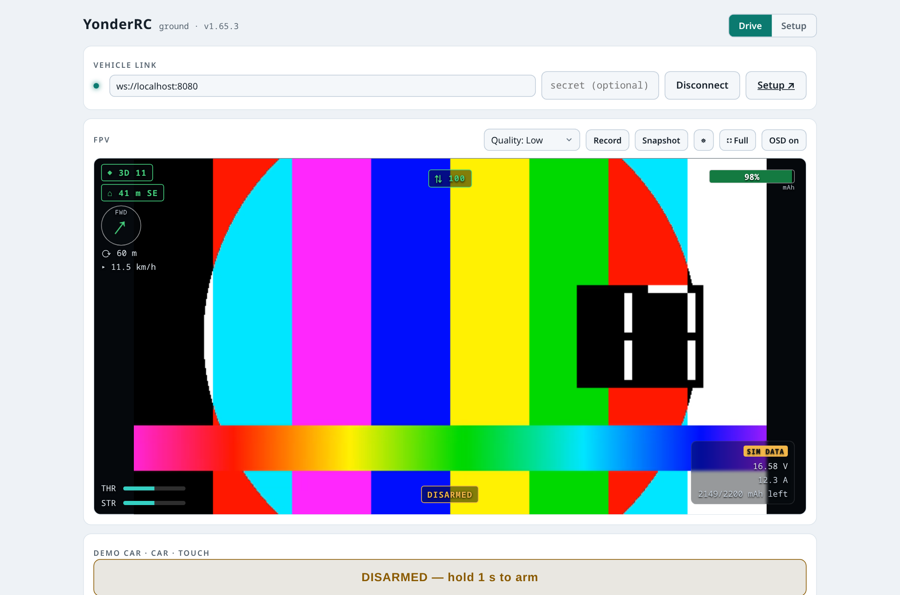
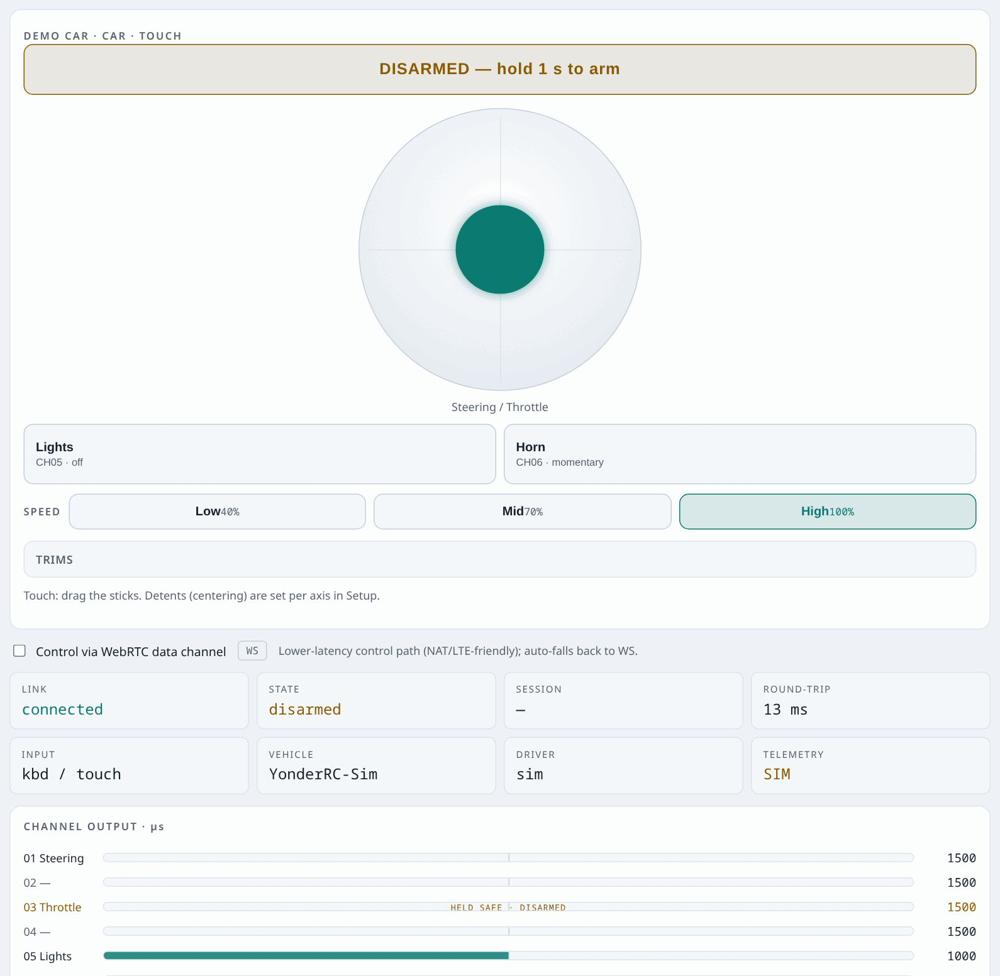
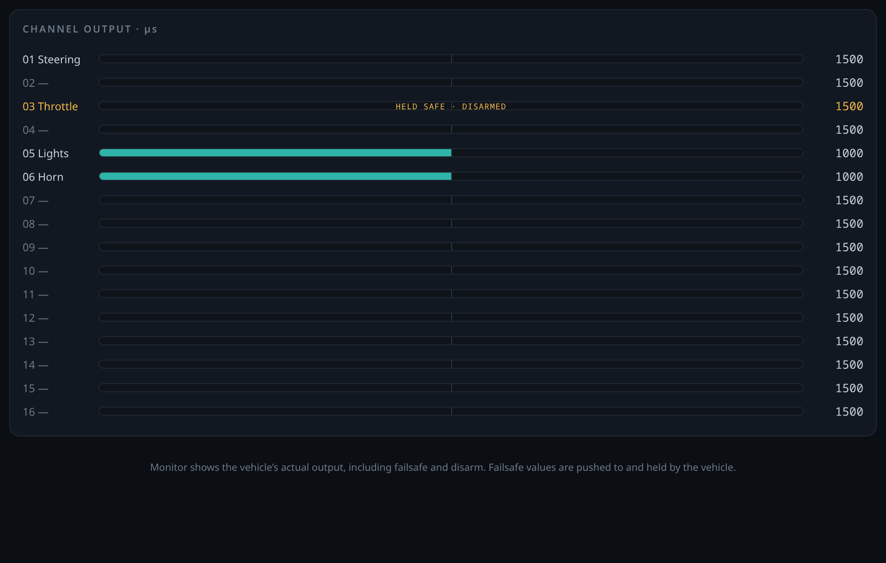
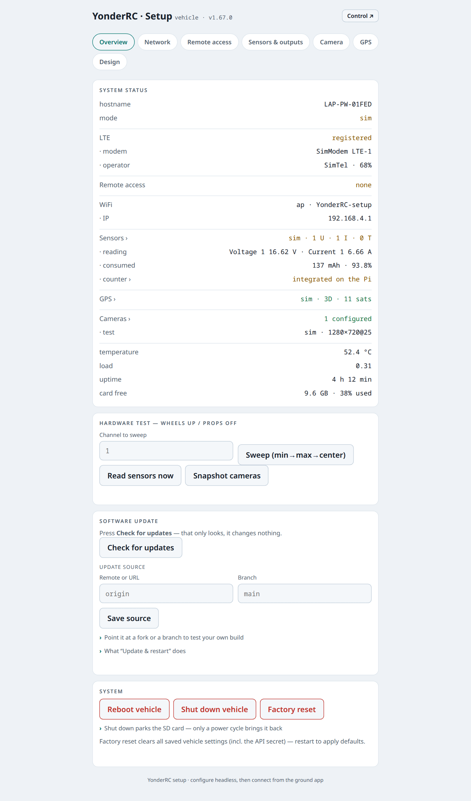

**English** · [Deutsch](README.de.md)

# YonderRC

Beyond-line-of-sight remote control over IP — an app for **video, control and
configuration** of cars, boats, planes and drones. Runs in the browser (incl. phone),
as a desktop app (Windows/Linux), and on a Raspberry Pi as the vehicle computer.
Low latency, built for operation over LTE.

Everything runs **in a simulator — with no hardware at all**. For the real build on
the Pi (parts list, wiring, step by step from Wi-Fi → LTE) see
[`docs/HARDWARE.md`](docs/HARDWARE.md).



*Ground station while driving: low-latency FPV video with OSD — battery charge bar
top right, link/latency data and voltage/current/capacity bottom right.*

---

## What YonderRC does

**Control**
- 16 channels over WebSocket or a WebRTC data channel; keyboard, on-screen buttons,
  gamepad, or a full touch joystick (multitouch, deadzone, spring return).
- **Models** for car / boat / plane / drone with matching channel templates,
  selectable input method, and per-axis detent (center/min/free).
- Per channel: trim, expo, reverse, endpoints (µs) and failsafe value.



*Touch control (multitouch joysticks, bindable buttons) with a status strip:
link, state, round-trip, input method, vehicle/driver, telemetry.*

**Safety**
- Time-based **failsafe watchdog**: if control frames stop arriving, every channel
  goes to its failsafe value. **Vehicle-type aware and separate from disarming** —
  a drone *holds* on link loss (throttle mid), a car/boat *stops*, a plane goes to
  *motor off*.
- **Arming**; every new connection starts disarmed. **Auto-disarm on reconnect** can
  be switched off (for plane/drone, where disarming in flight would cut the motors).
- Model switching and settings are locked while armed.



*Channel monitor: shows the **real** vehicle output in µs including failsafe and
disarm — the throttle channel is visibly held safe while disarmed.*

**Video (FPV)**
- Low-latency video over **go2rtc/WebRTC**; the H.264 encoder is auto-detected
  (`libx264`, `libopenh264`, Pi hardware).
- **Self-healing**: detects a frozen/dropped picture and reconnects automatically;
  the last frame stays on screen.
- **Video quality switchable live** from the ground station (high/medium/low).
- OSD with status, channels, **bitrate/packet loss/FPS/video latency** and telemetry.
- **Recording & snapshots** locally (pick a folder once; bindable to a key or a
  controller button).

**Telemetry**
- Voltage/current sensors (real: ADS1115/1015, MCP3008/3208, INA219/226/260/3221,
  ACS712/758 — or sim), **precise coulomb counting** (consumed mAh) and
  **battery percentage** from the configured capacity. Sim values are clearly marked
  **SIM**; when a real sensor is missing, the OSD shows **"NO SENSOR"** instead of
  faked numbers.

**Operation & setup**
- Graphical **setup page** served by the vehicle itself (`/setup`): driver, cameras,
  telemetry, watchdog, LTE APN, Tailscale — from a phone/laptop, no screen needed.

  

  *Setup page served by the vehicle: system status (mode, LTE, Tailscale, Wi-Fi),
  LTE APN and Tailscale remote access — usable from a phone with no screen.*
- **Guided hardware self-test**: channel sweep, read sensors, camera snapshot.
- **Self-sufficient in the field**: with no network the Pi starts a Wi-Fi hotspot and
  opens the control/setup page via a **captive portal** — the ground app is served by
  the Pi itself, so you can control and configure with nothing but a phone.
- Hardware drivers **PCA9685 / GPIO-PWM / SBUS** (native libs are optional),
  non-blocking **ESC calibration**, LTE + **Tailscale** against CGNAT.
- **Desktop app** (Electron) with a native SDL2 controller layer (hot-plug, rumble)
  and a fallback to the browser Gamepad API.

---

## Quick start

Requires Node 20+.

```bash
npm install
npm run dev
```

- Vehicle service: `ws://localhost:8080` (sim driver), setup at `/setup`.
- Ground station: `http://localhost:5173`.

Press **Connect**, then **Arm**, and drive with `W A S D` / arrow keys. From a phone
open `http://<PC-LAN-IP>:5173` (the dev server and the vehicle listen on all
interfaces).

**Video in the sim** (synthetic test pattern, needs `ffmpeg`):

```bash
npm run dev            # terminal 1: vehicle + ground app
npm run dev:video      # terminal 2: go2rtc with the test pattern
```

Mind the order: `npm run dev` detects the H.264 encoder and writes the go2rtc config;
then run `npm run dev:video`. Fedora: `sudo dnf install -y openh264 ffmpeg-free`.

**Tests:**

```bash
npm test               # safety / logic test suite
```

---

## On real hardware

The complete build on a Raspberry Pi — parts list, wiring, Pi setup, first on Wi-Fi
then switching to LTE with Tailscale — is in
**[`docs/HARDWARE.md`](docs/HARDWARE.md)**.

**1. Copy the repo onto the Pi** (`/opt/yonderrc`) — one way is enough:

```bash
# a) git clone (if the Pi has internet)
sudo mkdir -p /opt/yonderrc && sudo chown $USER /opt/yonderrc
git clone https://github.com/TechnikWeber/YonderRC.git /opt/yonderrc

# b) scp from the laptop (copy your local repo to the Pi) — run on the LAPTOP:
scp -r ~/YonderRC pi@yonderrc.local:/tmp/YonderRC
ssh pi@yonderrc.local 'sudo mkdir -p /opt/yonderrc && sudo cp -a /tmp/YonderRC/. /opt/yonderrc/'

# c) USB stick (Pi with no network) — insert the stick, then on the Pi:
sudo mkdir -p /opt/yonderrc && sudo cp -a /media/*/YonderRC/. /opt/yonderrc/   # check the path via lsblk
```

**2. Install and configure:**

```bash
sudo bash /opt/yonderrc/provisioning/install.sh   # Node, ffmpeg, go2rtc, systemd, I2C/UART
# then configure graphically at  http://<pi>:8080/setup
```

Driver selection via env (details in `docs/HARDWARE.md` and `provisioning/README.md`):

```bash
YRC_DRIVER=pca9685 npm run start -w @yonderrc/vehicle   # I2C PWM, 16 channels
YRC_DRIVER=gpio-pwm npm run start -w @yonderrc/vehicle   # pigpio
YRC_DRIVER=sbus     npm run start -w @yonderrc/vehicle   # SBUS to a flight controller
```

If a hardware driver fails to start, the service automatically falls back to `sim`
and stays reachable — a headless device never becomes unconfigurable.

---

## Project layout

```
packages/
  protocol/   shared TypeScript types (wire messages, channels, profiles, telemetry)
  vehicle/    vehicle service (Node/tsx): core, failsafe, drivers, sensors, go2rtc, setup
  ground/     ground station (React): control, FPV, OSD, recording, setup UI
  desktop/    Electron shell with native SDL2 input
docs/HARDWARE.md   hardware guide
provisioning/      Pi setup (systemd, LTE, Tailscale, hotspot/onboarding)
test/              test suite (npm test)
```

Everything above the transport is transport-agnostic; control travels over
WebSocket (fallback + signaling) or the WebRTC data channel.

---

## Versions

The current changes are in [`CHANGELOG.md`](CHANGELOG.md) and in the
[GitHub releases](https://github.com/TechnikWeber/YonderRC/releases). This README
always describes the current state.

## License

YonderRC is licensed under **CC BY-NC-ND 4.0** (Attribution – NonCommercial –
NoDerivatives) **plus one addition: no military or warfare use**. In short: use it for
free and pass on unmodified copies with attribution; no modifying, no commercial and
no military use. The full text is in [`LICENSE`](LICENSE).
